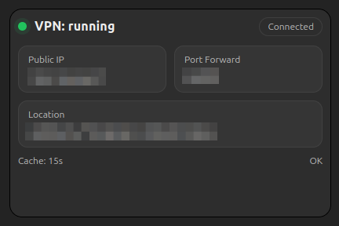

## Gluetun Port Forwarding Sync

To sync port forwarding from Gluetun to qbittorrent, the GSP=Qbittorrent-Gluetun-sync-port-mod is used (https://github.com/t-anc/GSP-Qbittorent-Gluetun-sync-port-mod).

1. Move `gluetun-sync-port-mod/gluetun_config.toml.example` to `gluetun-sync-port-mod/gluetun_config.toml`
2. Generate a key with `openssl rand -base64 50`.
3. Place that key in `gluetun-sync-port-mod\gluetun_config.toml` and also in `.env`.

## Gluetun Status Monitor

the gluetun_status service uses `./gluetun-status/app.py` and runs a small flask app to get status info and build a simple webpage. You can insert this as an iframe on Homarr to see your VPN status.

## URLs

Access is all routed through traefik. This includes both subdomains and paths. So make sure your domain and subdomain all point back to the same IP. Many of the apps (Radarr, Sonarr, etc.) use the `HOSTNAME` value from `.env` followed by a the app name as a path. But some apps (Overseerr, Plex, etc.) have trouble because they don't have a base url environment variable. So those are set with their own full URLs.

## Misc Notes

* Look into hard-linking when working out your media mount points. It lets you essentially sym link files from your downloader to your media storage. Keeps you from doubling up on storage. There is some config on the *arr apps you need to do to make that work.
* All the *arr apps and download clients are behind the VPN. You can still access them through the traefik addresses. No ports need to be exposed on those containers.
* First run will probably be an issue. After it is up, you will need to get into the various tools and get an API key to go into `.env` file. From there you can restart everything.
* My setup uses ProtonVPN. If you use something different, look up the docs on Gluetun. And you'll need to customize the gluetun monitor (`./gluetun-status/app.py`).
